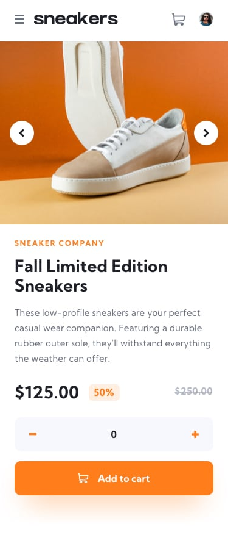

# E-commerce product page

This is a solution to a [Frontend Mentor](https://frontendmentor.io/) challenge.

It´s simple e-commerce product page. Project was created without using figma or sketch version, so the design is purely based on pictures.

It was fun to solve logic problems and create my own photo gallery. I learned a lot at this project.

The layout is fully responsive.

## Tools used

- [React](https://reactjs.org)
- [Styled components](https://styled-components.com/)
- [Visual Studio Code](https://code.visualstudio.com/)

- ### Desktop view 💻

  
  

- ### Mobile view 📱
  
